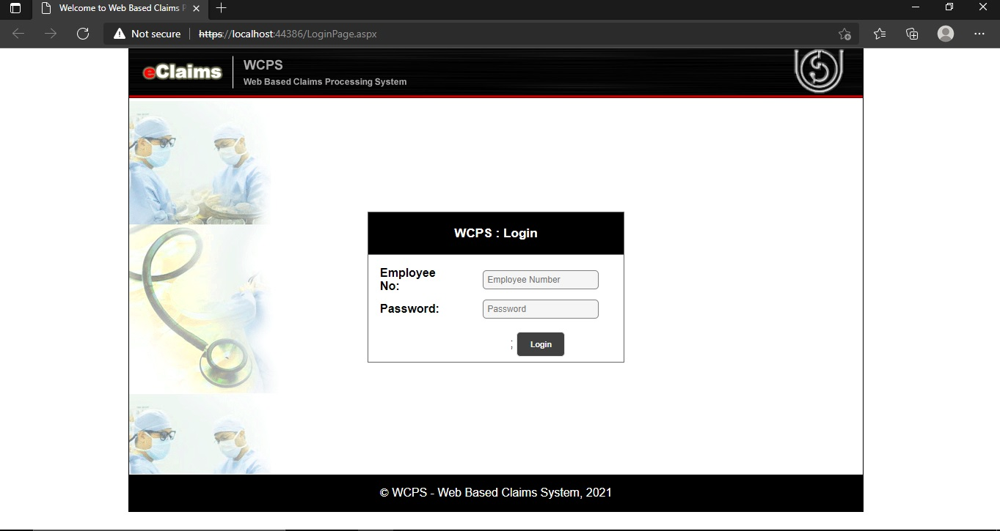
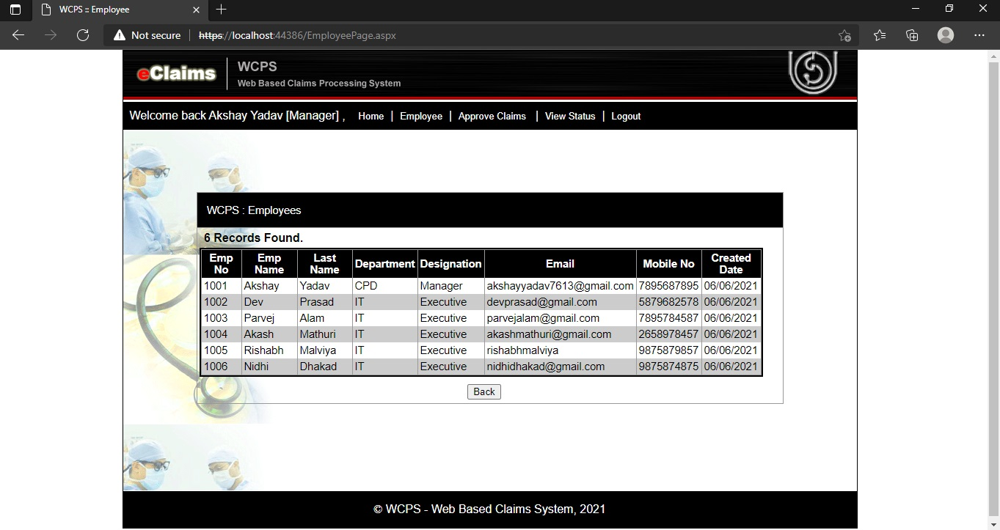
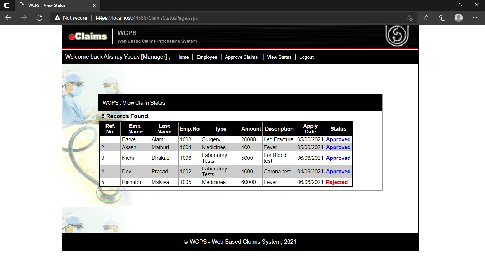
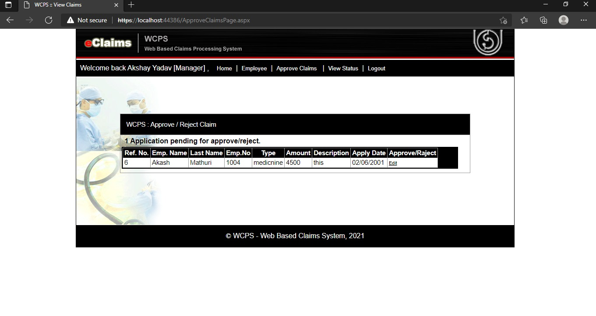

# Web Based Claims Processing System

MCA final year project..

## Purpose

ABC is a company which is having employee strength of at least 1000. All the employees are provided medical reimbursement facility which means that the expenditure incurred by the employee for treatment is reimbursed by the company. For reimbursement, the employee needs to fill in a form detailing the treatment undertaken which includes the name & cost of medicines, laboratory tests, surgery. The form is duly signed by the employee and it will be sent to the concerned Claims Processing Department (CPD) by messenger for processing. CPD will process it and the order regarding the reimbursement is sent to the Cash counter (CC) where in the employee can come and receive the reimbursement amount.

## Development Tools and Technologies
   - ASP.Net
   - C#
   - SQL Server 2014
   - Visual Studio 2019 IDE

 ## Screenshots 
 ### Login Page 
  </img>

 ### Employees Page 
  </img>

   ### View Claims Page 
  </img>

   ### Pending Page 
  </img>